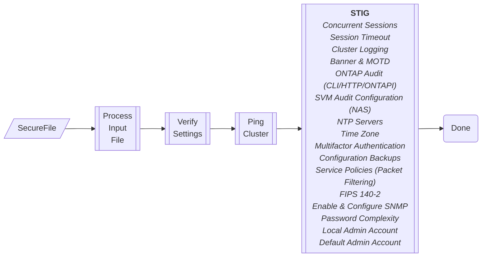
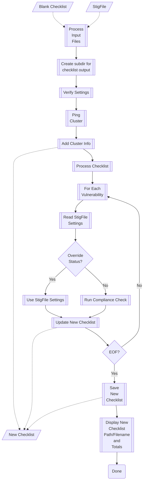

## **ONTAP 9 Security & STIG Compliance Checklist**

* [Description](#Description)
* [Requirements](#Requirements)
* [Preparation](#Preparation)
* [Provided Scripts](#Provided-Scripts)
* [Examples](#Examples)
* [Workflow](#Workflow)
* [Flowcharts](#Flowcharts)

### **Description**
* This is a set of PowerShell v7 scripts to apply security-related settings (`secure.ps1`), and complete a STIG Compliance checklist (`stig.ps1`)
* A set of .INI files provide the necessary parameters to configure the cluster security settings, and STIG checks
* The scripts are idempotent and can be re-executed without any 'known' issues

### **Requirements**
* Client system with network connectivity to ONTAP cluster and StorageGRID
* PowerShell version 7 installed 
* ONTAP 9.11.1 or later
* Cluster is correctly cabled and `cluster setup` has been executed (requires cluster IP address for scripts to access REST API)
* STIG Viewer version 2.17 or later (to review completed .ckl file generated by stig.ps1)

### **Preparation**
1. Copy the provided scripts and sample .ini files to a directory/location to run the scripts in PowerShell v7
2. Create an initial configuration (.ini) file for the cluster based on the associated template
3. Verify connectivity to the cluster (ping) or browse to `https://{clusterip}`
4. To apply security settings, create an initial secure configuration (.ini) file based on the associated template
5. To execute a STIG compliance check, create an initial STIG input file (.ini) for vulnerability testing based on the associated template

### **Provided Scripts**
* `secure.ps1` - Applies security-related STIG settings and configuration changes to an ONTAP system
* `stig.ps1` - Uses an ONTAP STIG checklist as input, and checks the ONTAP system for each vulnerability. Results are saved to a completed STIG checkist as output (.ckl).  

### **Examples**
* Apply security settings and configurations 

          PS C:\scripts > ./secure.ps1 -SecureFile secure1.ini -ClusterIP 10.0.0.10 -Login admin

* Perform an ONTAP STIG compliance check

          PS C:\scripts > ./stig.ps1 -StigFile stig1.ini -ClusterIP 10.0.0.10 -Login admin
          
* The .INI files can be in any path

          PS C:\scripts > ./secure.ps1 -SecureFile ./secure/secure1.ini -ClusterIP 10.0.0.10 -Login admin
          PS C:\scripts > ./stig.ps1   -StigFile   ./stigs/stig1.ini    -ClusterIP 10.0.0.10 -Login admin

### **Workflow**

**<u>secure.ps1</u>**

`./secure.ps1 -SecureFile <secure>.ini -ClusterIP <IP Address> -Login <admin account>`

1. Test for configuration file
2. Process configuration file
3. Verify Settings
4. Ping cluster IP (verify reachable)
5. Check REST API connection to cluster - Get cluster name and ONTAP version
6. Set Concurrent Sessions
7. Set Session Timeout
8. Configure Audit Account-enabling actions
9. Set Consecutive Failed Logon Attempts
10. Set Banner & Message of the Day for Cluster and SVMs
11. ONTAP Audit (CLI/HTTP/ONTAPI)
12. SVM Audit Configuration (NAS SVMs)
13. Add NTP Servers
14. Set Time Stamp for Audit Records (UTC/GMT)
15. Configure MultiFactor Authentication
16. On-Demand Cluster Configuration Backup
17. Service Policies (Packet Filtering)
18. Add Domain Accounts with Admin Role
19. Enable/Disable FIPS 140-2
20. Enable & Configure SNMP
21. Set Password Complexity Minimums
22. Create Account of Last Resort (1 Local Admin Account)
23. Check if Reboot Required
24. Lock / Unlock Default `admin` Account

**<u>stig.ps1</u>**

`./stig.ps1 -StigFile <stig>.ini -ClusterIP <IP Address> -Login <admin account>`

1. Verify blank STIG checklist and .ini file path/name
2. Create subdirectory for STIG files/checklists
3. Process {stig}.ini file
4. Verify Settings
5. Ping cluster IP (verify reachable)
6. Check REST API connection to cluster - Get cluster name and ONTAP version
7. Open a new checklist file (XML) for output using blank as template
8. Add host name, host IP, domain, and ONTAP version to checklist
9. Process (loop) through each vulnerability in the checklist
10. Check the settings in the .ini file related to the current vulnerability number
11. If 'override_status' is NOT BLANK, then skip the check and use the override_status, details, and comments in the .ini
12. If 'override_status' is BLANK, then run the compliance check
13. Update the new checklist with the result (Open, Not A Finding, Not Applicable, Not Reviewed) along with any Details or Comments
14. Once all vulnerabilities have been processed - save/close the new checklist
15. Screen output shows the name of the saved checklist - ontapstig_{clustername}_YYYY_MM_DD.ckl and totals for each type of finding.
16. To view the completed checklist, use the DISA STIG Viewer

### **Flowcharts**

**secure.ps1**

**stig.ps1**

 
 
